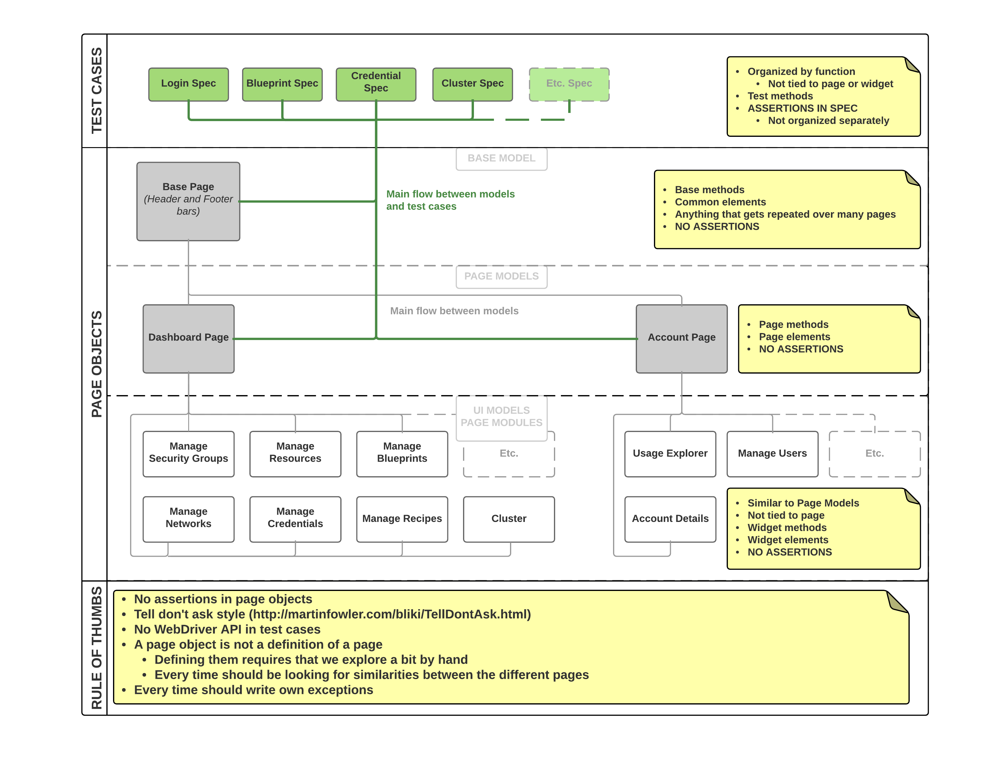

# Cloudbreak Web GUI (ULUWATU) functional tests (Protractor, Jasmine)

## Description
Cloudbreak web application functional end-to-end test project.

## Technology stack
- [Protractor](https://angular.github.io/protractor/#/)
  - "Protractor is an end-to-end test framework for AngularJS applications. Protractor runs tests against your application running in a real browser, interacting with it as a user would."
  - [WebDriverJS](http://webdriver.io/)
      - [WebDriver's JavaScript API](https://github.com/SeleniumHQ/selenium/wiki/WebDriverJs)
      - ..."WebDriver's JavaScript API is entirely asynchronous and every command results in a promise. Promise-heavy APIs will be a lot easier to work with"..."Implicitly synchronizes asynchronous actions, making it so you only have to register a promise callback when you want to catch an error or access a return value."...
  - [NodeJS](https://nodejs.org/api/)
      - "Node.js® is a JavaScript runtime built on Chrome's V8 JavaScript engine. Node.js uses an event-driven, non-blocking I/O model that makes it lightweight and efficient. Node.js' package ecosystem, npm, is the largest ecosystem of open source libraries in the world."
- [Protractor Console](https://www.npmjs.com/package/protractor-console)
  - "Display log statements from the browser that occur while Protractor tests are running"..."Associates logs with individual tests, printing them after each test run."
- [Jasmine](http://jasmine.github.io/)
  - "Jasmine is an open source testing framework for JavaScript."
- [Jasmine Allure Reporter](https://www.npmjs.com/package/jasmine-allure-reporter)
  - "Allure Framework reporter to Jasmine and its derivatives (Protractor)"..."to generate an Allure report out of Jasmine tests."
- [Node SSH Exec](https://www.npmjs.com/package/node-ssh-exec)
  - "A simple ssh2 wrapper to exec shell commands on remotes via ssh using Node.js."
- [AWS SDK](https://www.npmjs.com/package/aws-sdk)
  - "The official AWS SDK for JavaScript, available for browsers and mobile devices, or Node.js backends."
- [Selenium Grid](https://github.com/SeleniumHQ/selenium/wiki/Grid2)
  - "Selenium Grid support distributed test execution. It manages multiple environments from a central point, making it easy to run the tests against a vast combination of browsers / OS."
- [Docker](https://docs.docker.com/)
  - "Docker packages your app with its dependencies, freeing you from worrying about your system configuration, and making your app more portable."
- [Docker Compose](https://docs.docker.com/compose/)
  - "Compose is a tool for defining and running multi-container Docker applications."
- [Make](https://www.gnu.org/software/make/manual/make.html)

## Structure


### Introduction to Page Object Pattern
You can check all the needed information on the [Page Object Pattern page](/pages/PAGEOBJECTPATTERN.md)

## Prerequisites
Every variable from [environment file](utils/testenv) should be present as environment variables with valid values:

> For OS X Yosemite users with IntelliJ IDEA: You should add the environment variables to your
`bash_profile` to can run tests directly form IDEA with no issues.
The file should contain the variables for examples:
```
export BROWSER=chrome
launchctl setenv BROWSER $BROWSER
export BASE_URL=your.url
launchctl setenv BASE_URL $BASE_URL
export USERNAME=your@mail.address
launchctl setenv USERNAME $USERNAME
export PASSWORD=your.password
launchctl setenv PASSWORD $PASSWORD
export SSHKEY=`AAAAB3NzaC1+soon...`
launchctl setenv SSHKEY $SSHKEY
...etc.
```
> Please do not forget you should reopen your project and restart your IDEA.

## Executing Protractor tests
> If your Protractor test environment has just cloned, you should set up its Node environment first (install every needed packages and tools). The easiest way to get all the needed Node packages in one round to use `npm install`. Please check the [npm-install](https://docs.npmjs.com/cli/install) documentation. Beyond these please check the [Protractor Tutorial](https://angular.github.io/protractor/#/tutorial).
> You do not need to launch the `webdriver-manager` for these tests, because of the `directConnect` is `true` by default in the [Protractor configuration](e2e.conf.js). In this case the Protractor works directly with Chrome or Firefox Driver, bypassing any Selenium Server.

Execute the tests based on the configuration:
```
protractor e2e.conf.js
```

# Docker image for ULUWATU functional test project

**Docker image for executing headless Google Chrome or Firefox Protractor e2e test cases in Docker container.**

The [Dockerfile](https://hub.docker.com/r/hortonworks/docker-e2e-protractor/) and image are available on Docker Hub and is maintained in a separate project. 

## To run ULUWATU tests in this container

1. Clone this repository to your local folder.
2. Set your local Node environment up (install every needed packages and tools) for the project.
  - The easiest way to get all the needed Node packages in one round, apply the following from the root of the project where the `package.json` is located:
   ```
   npm install
   ```
3. Provide valid and appropriate values for base test parameters in the [environment file](utils/testenv), for example:
  - BROWSER=`chrome`
  - BASE_URL=`https://cloudbreak.sequenceiq.com/`
  - USERNAME=`testing@something.com`
  - PASSWORD=`password`
  - SSHKEY=`AAAAB3NzaC1+soon...`
  - ...etc.
4. Pull the [hortonworks/docker-e2e-protractor](https://hub.docker.com/r/hortonworks/docker-e2e-protractor/) image from DockerHub.
5. Execute the Protractor test configuration for ULUWATU in [Docker container](https://docs.docker.com/engine/installation/), for example:
    ```
    docker run -it --rm --name uluwatu-e2e-runner --env-file utils/testenv -v $(PWD):/protractor/project -v /dev/shm:/dev/shm hortonworks/docker-e2e-protractor e2e.conf.js --suite smoke
    ```
  - `uluwatu-e2e-runner` name of the new Docker container (created from `hortonworks/docker-e2e-protractor` Docker image).
  - `utils/testenv` the location (full path) of the `testenv` file on your machine.
  - `$(PWD)` or `$pwd` the root folder of your Protractor test project.
      - For example the local folder where the test project has been cloned from GitHub.
      - The use of **PWD is optional**, you do not need to navigate to the Protractor test project root. If it is the case, you should add the full path of the root folder instead of the `$(PWD)`.
  - `e2e.conf.js --suite smoke` test configurations with selected suit to execute.

# Parallel test execution with Grid2 and Docker Compose

**Docker image for building Selenium Grid with headless Google Chrome or Firefox plus video recording support in Docker containers.**

The Grid is building with the help of [Docker Compose](https://docs.docker.com/compose/) based on the previously defined [Docker Compose File](docker-compose.yml). The Selenium Docker image is available at [Leo Gallucci's (aka elgalu) Docker Selenium Project](https://github.com/elgalu/docker-selenium). Please check the documentation for this project before next steps.

## To run ULUWATU tests in Parallel

1. Clone this repository to your local folder.
2. Set your local Node environment up (install every needed packages and tools) for the project.
  - The easiest way to get all the needed Node packages in one round, apply the following from the root of the project where the `package.json` is located:
    ```
    npm install
    ```
3. Provide valid and appropriate values for base test parameters in the [environment file](utils/testenv), for example:
  - BROWSER=`firefox`
  - BASE_URL=`https://cloudbreak.sequenceiq.com/`
  - USERNAME=`testing@something.com`
  - PASSWORD=`password`
  - SSHKEY=`AAAAB3NzaC1+soon...`
  - ...etc.
4. Pull the [hortonworks/docker-e2e-protractor](https://hub.docker.com/r/hortonworks/docker-e2e-protractor/) image from DockerHub.
5. Pull the [elgalu/selenium](https://hub.docker.com/r/elgalu/selenium/) image from DockerHub.
6. Launch the Selenium Grid:
    ```
    docker-compose -p e2etestgrid up -d
    ```
  - Once the Grid is up and running, the scaling can be started, for example:
    ```
    docker-compose -p e2etestgrid scale firefox=2
    ```
  - `e2etestgrid` name of the new multi Docker container system (created from `elgalu/selenium` Docker image).
  - `firefox=2` the number of Selenium Nodes with Firefox browser.
7. Very important ISPARALLEL=true and PARALLELBROWSERS=2 environment variables should be set before next step.
8. Execute the Protractor test configuration for ULUWATU in [Docker container](https://docs.docker.com/engine/installation/), for example:
    ```
    docker run -it --rm --name uluwatu-e2e-runner --env-file utils/testenv -v $(PWD):/protractor/project -v /dev/shm:/dev/shm hortonworks/docker-e2e-protractor e2e.conf.js --suite regression
    ```
  - `uluwatu-e2e-runner` name of the new Docker container (created from `hortonworks/docker-e2e-protractor` Docker image).
  - `utils/testenv` the location (full path) of the `testenv` file on your machine.
  - `$(PWD)` or `$pwd` the root folder of your Protractor test project.
      - For example the local folder where the test project has been cloned from GitHub.
      - The use of **PWD is optional**, you do not need to navigate to the Protractor test project root. If it is the case, you should add the full path of the root folder instead of the `$(PWD)`.
  - `e2e.conf.js --suite regression` test configurations with selected suit to execute.

> On this way the regression test suit is executed in a newly built Selenium Grid with two Firefox browsers. So the regression tests execution time can be reduced to half.

# Run tests in CI

The project's [Makefile](Makefile) contains several [rules](https://www.gnu.org/software/make/manual/make.html#Rules) what you can use with your CI jobs. For example:
```
cloudbreak-run-ui-it-test:
				./scripts/cloudbreak-ui-integration-test.sh
```
- `cloudbreak-run-ui-it-test` the target of the rule
- `./scripts/cloudbreak-ui-integration-test.sh` the recipe of the rule

> As you can see here the project contains some predefined [bash scripts](scripts) to automate Grid2 launch and test environment setup before tests execution in one round with the help of make rules.

# Advanced options

## Protractor direct connect
Protractor can test directly using Chrome Driver or Firefox Driver, [bypassing any Selenium Server](https://github.com/angular/protractor/blob/master/docs/server-setup.md#connecting-directly-to-browser-drivers). **The advantage of direct connect is that your test project start up and run faster.**

To use this, you should change your [config file](https://github.com/sequenceiq/uluwatu-e2e-protractor/blob/master/e2e.conf.js#L15):
```
directConnect: true
```
>**If this is true, settings for seleniumAddress and seleniumServerJar will be ignored.** If you attempt to use a browser other than Chrome or Firefox an error will be thrown.

## No sandbox for Google Chrome
Chrome does not support to [running it in container](https://github.com/travis-ci/travis-ci/issues/938#issuecomment-77785455). So you need to start the Chrome Driver with `--no-sandbox` argument to avoid errors.

In the [Protractor configuration file](https://github.com/sequenceiq/uluwatu-e2e-protractor/blob/master/e2e.conf.js#L19-L27):
```
capabilities: {
     'browserName': 'chrome',
     /**
      * Chrome is not allowed to create a SUID sandbox when running inside Docker
      */
     'chromeOptions': {
         'args': ['no-sandbox']
     }
},
```
## --privileged
Chrome uses sandboxing, therefore if you try and run Chrome within a non-privileged container you will receive the following message:

> "Failed to move to new namespace: PID namespaces supported, Network namespace supported, but failed: errno = Operation not permitted".

The `--privileged` flag gives the container almost the same privileges to the host machine resources as other processes running outside the container, which is required for the sandboxing to run smoothly.

<sub>Based on the [Webnicer project](https://hub.docker.com/r/webnicer/protractor-headless/).</sub>

## Makefile
We created a [Makefile](Makefile) to automate several prerequisites for test execution and the test execution itself.

### Run Smoke Tests in Docker
So you are able to execute the smoke tests easily in Docker container with the help of [Make](https://www.gnu.org/software/make/manual/make.html):
```
make refresh-image
```
then
```
make run
```

## In-memory File System /dev/shm (Linux only)
Docker has hardcoded value of 64MB for `/dev/shm`. Error can be occurred, because of [page crash](https://bugs.chromium.org/p/chromedriver/issues/detail?id=1097) on memory intensive pages. The easiest way to mitigate the problem is share `/dev/shm` with the host.
```
docker run -it --rm --name uluwatu-e2e-runner --env-file utils/testenv -v /dev/shm:/dev/shm -v $(PWD):/protractor/project hortonworks/docker-e2e-protractor
```
The size of `/dev/shm` in the Docker container can be changed when container is made with [option](https://github.com/docker/docker/issues/2606) `--shm-size`.

For Mac OSX users [this conversation](http://unix.stackexchange.com/questions/151984/how-do-you-move-files-into-the-in-memory-file-system-mounted-at-dev-shm) can be useful. 

<sub>Based on the [Webnicer project](https://hub.docker.com/r/webnicer/protractor-headless/).</sub> 

## --net=host
This options is required only if the dockerised Protractor is run against localhost on the host.

**Imagine this scenario:**
Run an http test server on your local machine, let's say on port 8000. You type in your browser http://localhost:8000 and everything goes smoothly. Then you want to run the dockerised Protractor against the same localhost:8000. If you don't use `--net=host` the container will receive the bridged interface and its own loopback and so the localhost within the container will refer to the container itself. Using `--net=host` you allow the container to share host's network stack and properly refer to the host when Protractor is run against localhost.

<sub>Based on the [Webnicer project](https://hub.docker.com/r/webnicer/protractor-headless/).</sub>